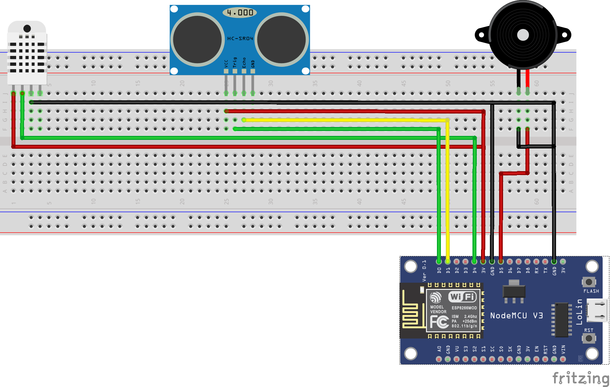
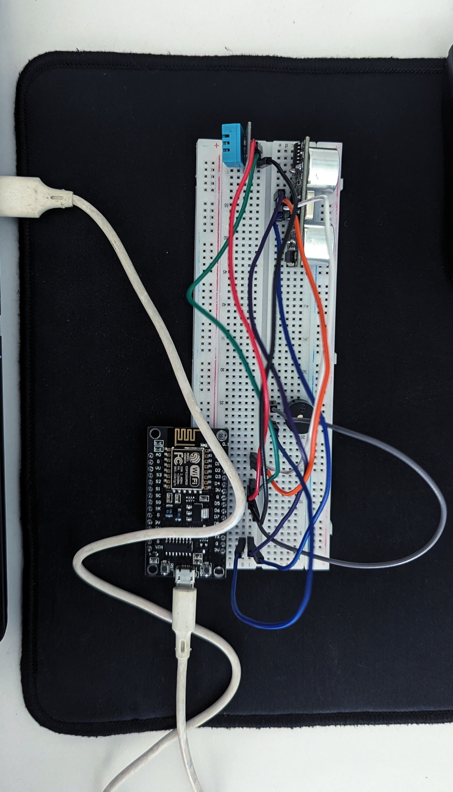

# SmartGuard: Integrated Intruder Detection and Environmental Monitoring System

SmartGuard is an Intruder Detection System that also monitors temperature and humidity. The system utilizes the ESP8266 microcontroller and integrates with the Blynk app to provide real-time updates and notifications. It includes a buzzer that sounds an alert when an intruder is detected, and it sends notifications through email and the Blynk app.

## Features

- **Temperature and Humidity Monitoring**: Uses a DHT11 sensor to measure temperature and humidity.
- **Intruder Detection**: Uses an HC-SR04 ultrasonic sensor to detect intruders.
- **Buzzer Alert**: Sounds a buzzer when an intruder is detected.
- **Real-Time Notifications**: Sends notifications via the Blynk app and email.
- **Blynk App Integration**: Displays real-time temperature, humidity, and intruder distance on the Blynk app.
- **Data Logging**: Maintains a history of temperature, humidity, and intruder detection data.
- **Temperature Alert**: Sends an email notification if the temperature exceeds 20°C.

## Hardware Components

- **DHT11**: Temperature and Humidity Sensor
- **HC-SR04**: Ultrasonic Sensor for Intruder Detection
- **ESP8266**: Wi-Fi Microcontroller
- **Buzzer**: For Audible Alerts

## Installation

### Prerequisites

Before you begin, ensure you have the following:

- Arduino IDE installed on your computer.
- Relevant board drivers installed in the Arduino IDE for the ESP8266.
- Libraries installed in the Arduino IDE:
  - `ESP8266WiFi`
  - `BlynkSimpleEsp8266`
  - `DHT`

### Steps

1. **Download the Code**:
   - Copy the code from [`smartguard.ino`](smartguard.ino) in this repository.

2. **Open Arduino IDE**:
   - Launch the Arduino IDE on your computer.

3. **Paste the Code**:
   - Create a new sketch in the Arduino IDE.
   - Paste the copied code into the new sketch.

4. **Configure Wi-Fi and Blynk Credentials**:
   - Update the following lines in the code with your Wi-Fi and Blynk credentials:
     ```cpp
     char ssid[] = "your_wifi_ssid";
     char pass[] = "your_wifi_password";
     #define BLYNK_AUTH_TOKEN "your_blynk_auth_token"
     ```

5. **Upload the Code**:
   - Connect your ESP8266 to your computer via USB.
   - Select the correct board and port in the Arduino IDE.
   - Click on the upload button to upload the code to your ESP8266.

## Usage

1. **Power the System**:
   - Connect your ESP8266 to a power source.

2. **Open the Blynk App**:
   - Monitor real-time data on the Blynk app.

3. **Receive Notifications**:
   - Get alerts on the Blynk app and email for temperature and intruder detection events.

## Code Explanation

The main functionality of the code is divided into several functions:

- **`sendSensorData`**: Reads temperature and humidity from the DHT11 sensor and sends the data to the Blynk app. Triggers a temperature alert if the temperature exceeds 20°C.
- **`measureUltrasonicDistance`**: Measures the distance using the HC-SR04 ultrasonic sensor. Sends the distance data to the Blynk app and triggers an intruder alert if an intruder is detected.
- **`setup`**: Initializes the ESP8266, connects to Wi-Fi, and sets up the sensors and Blynk timer.
- **`loop`**: Runs the Blynk and timer functions continuously to keep the system operational.

## Code: [`smartguard.ino`](smartguard.ino)

For more details, please refer to the full code in the repository. [Complete Code](smartguard.ino)

## Images for Reference:







### More Images for Reference:

- More images can be found in the [images folder](images/) in this repository.

## Notes:

- Replace ['smartguard.ino'](smartguard.ino) with the actual name of your Arduino sketch file.
- Ensure the Markdown formatting is correct, especially with code blocks and lists.
- Customize the Wi-Fi credentials and other configurations as per your setup.
- Mention any specific details or instructions relevant to your project in the appropriate sections of the `README.md` file.
- More images can be found [here](images/)
